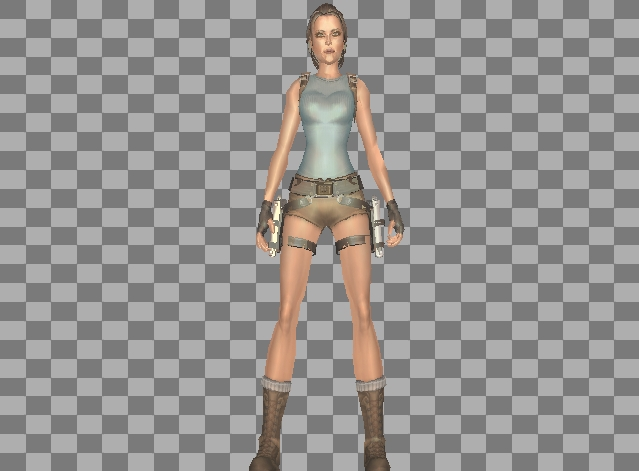



## EGL\_3DStudioPro 5

### Description

Added Shadow Matrix. Transparency bugs have been fixed in this version. Code optimization was achieved greatly. Texturing of the material gathered in a single module. 3d model served as the fastest ever. DirectX or OpenGL is not used. In addition, the filter feature added with bilinear. Thus a more realistic view was obtained. 2nd addition, useful Color Selector dialog box. This upload the final project of 3D viewer. Thank you to my friends in the PSC.(Zip:980 kb)
 
### More Info
 

             |
---                |---
**Submitted On**   |2012-01-22 21:59:16
**By**             |[Erkan Sanli](https://github.com/Planet-Source-Code/PSCIndex/blob/master/ByAuthor/erkan-sanli.md)
**Level**          |Advanced
**User Rating**    |5.0 (20 globes from 4 users)
**Compatibility**  |VB 6\.0
**Category**       |[Graphics](https://github.com/Planet-Source-Code/PSCIndex/blob/master/ByCategory/graphics__1-46.md)
**World**          |[Visual Basic](https://github.com/Planet-Source-Code/PSCIndex/blob/master/ByWorld/visual-basic.md)
**Archive File**   |[EGL\_3DStud2218771232012\.zip](https://github.com/Planet-Source-Code/erkan-sanli-egl-3dstudiopro-5__1-74239/archive/master.zip)

